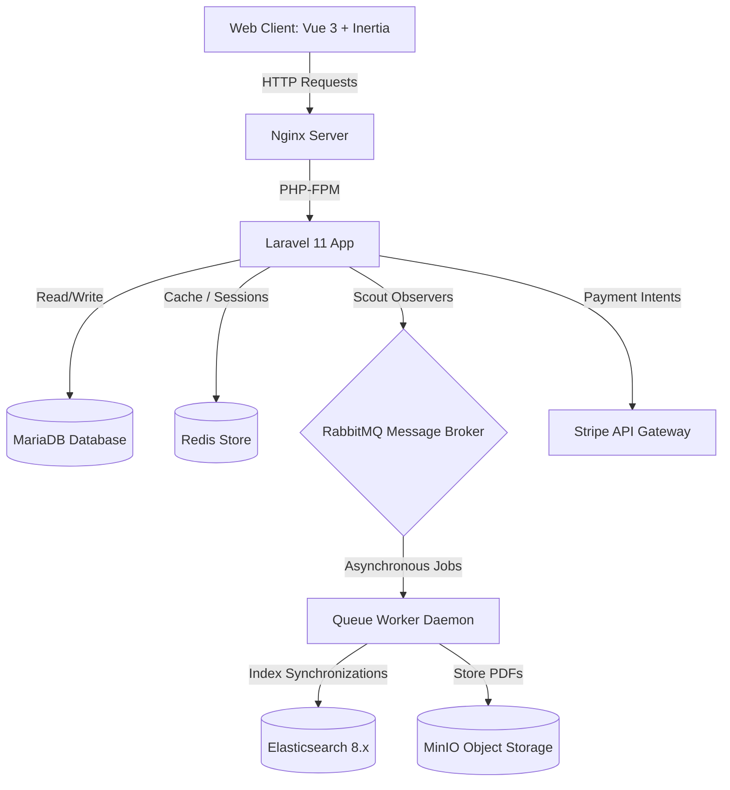

# Project Context Manifest: eShop Platform

This document serves as an AI-readable index mapping the architecture, technology stack, directory layouts, and custom business integrations of the eShop e-commerce application.

---

## 1. Architectural Overview & Technology Stack

The eShop platform is a containerized web application split into a Laravel RESTful JSON API layer and a reactive Vue.js client hydrated dynamically using Inertia.js protocol.

### Infrastructure Components
* **Language/Frameworks**: PHP 8.4 + Laravel 11.x, TypeScript + Vue 3 (Composition API, `<script setup>`), Inertia.js 3.0.
* **Storage Engines**: MariaDB 10.11 (configured with strict SQL group-by rules), Redis 7.
* **Object Repository**: MinIO (S3-compatible bucket storing carrier invoice/label PDFs).
* **Asynchronous Queue**: RabbitMQ 3 (monitored by the `queue-worker` container running `php artisan queue:work`).
* **Fuzzy Text Search**: Elasticsearch 8.11.1 (linked via Laravel Scout `^11.3` and the downgraded client adapter `elasticsearch/elasticsearch:^8.19` + `elastic-scout-driver:^4.0` for version compatibility).

---

## 2. Key Directories & File Layouts

### Backend Domain Logic
* **Eloquent Database Models** ([app/Models](file:///home/micao/Projects/eshop/app/Models/)):
  * [Product.php](file:///home/micao/Projects/eshop/app/Models/Product.php): Uses the `Searchable` trait. Defines fields mapped to Elasticsearch in `toSearchableArray()`.
  * [Variant.php](file:///home/micao/Projects/eshop/app/Models/Variant.php): Sub-model containing pricing options, SKUs, and inventory stock amounts.
  * [Cart.php](file:///home/micao/Projects/eshop/app/Models/Cart.php) & [CartItem.php](file:///home/micao/Projects/eshop/app/Models/CartItem.php): Database-backed shopping cart tables.
  * [Order.php](file:///home/micao/Projects/eshop/app/Models/Order.php) & [OrderItem.php](file:///home/micao/Projects/eshop/app/Models/OrderItem.php): Persistent logs capturing address snapshots, Stripe transaction keys, tracking numbers, and label URLs.
  * [UserAddress.php](file:///home/micao/Projects/eshop/app/Models/UserAddress.php): Address book logs.
* **Application Services** ([app/Services](file:///home/micao/Projects/eshop/app/Services/)):
  * [CartService.php](file:///home/micao/Projects/eshop/app/Services/CartService.php): Handles live totals calculation, checks stock limits, and merges guest/member carts.
  * `Shipping/`: Contains `ShippingManager` and `FlatRateDriver` (charges €5 delivery, and waives shipping fees if order value exceeds €50).
  * `Payment/`: Contains `PaymentManager` dynamically routing to `StripePaymentGateway` or `MockPaymentGateway` drivers.
* **HTTP Controllers** ([app/Http/Controllers](file:///home/micao/Projects/eshop/app/Http/Controllers/)):
  * [StorefrontController.php](file:///home/micao/Projects/eshop/app/Http/Controllers/StorefrontController.php): Renders storefront Welcome catalog page, single product details, and the profile pages.
  * `Api/CartController.php`: Manages cart CRUD and guest merges.
  * `Api/CheckoutController.php`: Retrieves shipping options and processes checkout orders.
  * `Api/StripeWebhookController.php`: Captures external Stripe Webhook callbacks.

### Frontend Presentation Layer
* **Storefront Layout** ([StorefrontLayout.vue](file:///home/micao/Projects/eshop/resources/js/layouts/storefront/StorefrontLayout.vue)): Core wrap containing global navigation headers, search input triggers, and cart drop-downs.
* **Shopping Views** ([resources/js/pages/catalog](file:///home/micao/Projects/eshop/resources/js/pages/catalog/)):
  * [Cart.vue](file:///home/micao/Projects/eshop/resources/js/pages/catalog/Cart.vue): Shopping cart table item options.
  * [Checkout.vue](file:///home/micao/Projects/eshop/resources/js/pages/catalog/Checkout.vue): Step-by-step wizard panel (Address selector -> Shipping rates -> Payment choice).
  * [CheckoutSuccess.vue](file:///home/micao/Projects/eshop/resources/js/pages/catalog/CheckoutSuccess.vue): Displays order summaries, tracking parameters, and label download links.
* **Profile Settings** ([resources/js/pages/settings](file:///home/micao/Projects/eshop/resources/js/pages/settings/)):
  * `Profile.vue`: Basic user information (Name and Email).
  * [Addresses.vue](file:///home/micao/Projects/eshop/resources/js/pages/settings/Addresses.vue): Saved delivery address book manager.

---

## 3. High-Fidelity Business Integrations

### Guest Cart Auto-Merge on Login
* **Mechanism**: Unregistered guests save items in browser `LocalStorage`.
* **Merge Hook**: On page mount inside `StorefrontLayout.vue`, if the user has an active authenticated session (`$page.props.auth.user`) and `eshop_cart` items exist in storage, the script executes `POST /api/cart/merge` transmitting the payload, clears `LocalStorage`, and fires `cart-updated` events.

### Stripe Two-Stage Async Checkout
* **Checkout Order Placement**: Placed orders start as `pending` with `pending` payment status. The cart is not emptied, and inventory stock remains unchanged. This prevents locking items if the buyer abandons the transaction during Stripe redirects.
* **Asynchronous Settlement**: Upon payment completion, Stripe calls `POST /api/webhooks/stripe` (exempt from CSRF verification inside `bootstrap/app.php` and `web.php`).
* **Webhook Action**: The `StripeWebhookController` catches the request, verifies the signature, and runs a **database transaction** to update order status to `processing` (paid), subtract variant inventories, attach tracking logs, and empty the cart.

### Elasticsearch ID Filter & Cross-Database Relevancy Sorting
* **Query Re-routing**: Catalog searches execute `Product::search($search)->keys()` to query Elasticsearch, retrieving matching product IDs sorted by relevance score.
* **SQL Adaptations**:
  * Under **MariaDB/MySQL** (production), sorts using the native `ORDER BY FIELD(id, ...)` query syntax.
  * Under **SQLite** (in-memory unit tests), fallback-sorts via standardized SQL `CASE WHEN id = ? THEN ? ... END` syntax, ensuring cross-platform stability.

### Multi-dimensional Filtering
* **Storefront Catalog**: Users can filter products dynamically by category slugs, brand slugs, price boundaries, and stock availability. Eager loading avoids N+1 queries.
* **Admin Dashboard**: Administrators can filter catalog products using combinations of category ID, brand ID, supplier ID, and price min/max ranges, accompanied by search bar text parameters.

---

## 4. Testing & Isolated Mocking

* **Test Configuration** ([phpunit.xml](file:///home/micao/Projects/eshop/phpunit.xml)):
  * Configured with `<env name="SCOUT_DRIVER" value="collection"/>`.
  * Reroutes all search assertions (`Product::search()`) to local, in-memory Eloquent query builders, keeping testing suites fast and independent from Elasticsearch server states.
